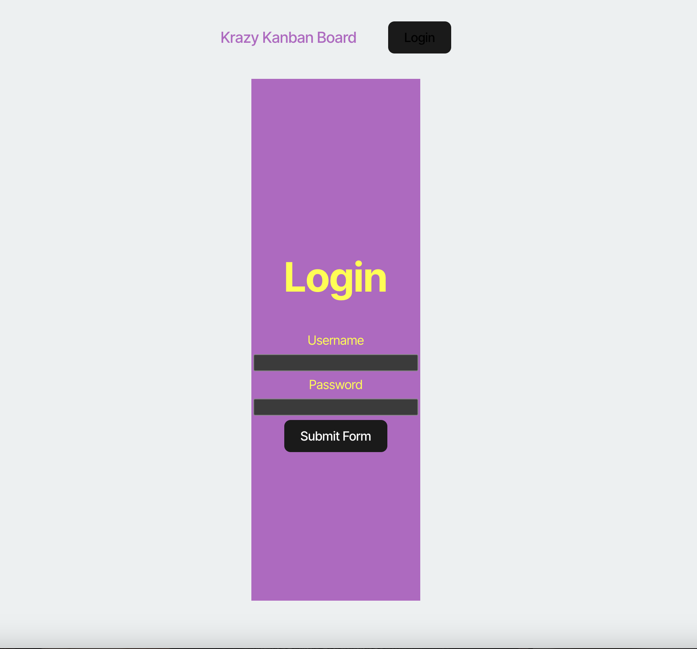

# Kanban Board with JWT Authentication

This project is a Kanban board application that incorporates secure authentication using JSON Web Tokens (JWT). The goal of this project is to enhance an existing Kanban board by adding authentication features to both the client and server and deploying the application to Render. this application is live at: https://kanban-board-rptx.onrender.com/ 

## Preview



## Features

### Login Page
- A login page with form inputs for username and password.
- Validation for user credentials.
- Redirection to the main Kanban board page upon successful login.

### Authentication with JWT
- Users are authenticated using JWT.
- Valid JWT tokens are stored securely in the client's local storage.
- Protected routes ensure that only authenticated users can access the Kanban board.

### Error Handling
- Displays error messages for invalid username or password attempts.

### Session Management
- JWT is removed from local storage upon logout.
- Sessions expire after a defined period of inactivity, invalidating the JWT.

### Deployment
- The entire application is deployed to Render.

## User Stories

1. **Login Page**
   - When I load the login page, I am presented with form inputs for username and password.
2. **Authentication**
   - When I enter my valid username and password, I am authenticated using JWT and redirected to the main Kanban board page.
   - When I enter an invalid username or password, I am presented with an error message indicating that the credentials are incorrect.
3. **JWT Storage**
   - When I successfully log in, a JWT is stored securely in the client's local storage for subsequent authenticated requests.
4. **Logout**
   - When I log out, the JWT is removed from the client's local storage, and I am redirected to the login page.
5. **Protected Routes**
   - When I try to access the Kanban board page without being authenticated, I am redirected to the login page.
6. **Session Expiry**
   - When I remain inactive for a defined period, my session expires, the JWT is invalidated, and I am redirected to the login page upon my next action.

## Technology Stack

### Frontend
- Vite
- React
- TypeScript

### Backend
- Node.js
- Express
- Sequelize (PostgreSQL ORM)

### Authentication
- JSON Web Tokens (JWT)
- bcrypt for password hashing

### Deployment
- Render (for both client and server)

## Setup Instructions

### Prerequisites
- Node.js installed on your system
- PostgreSQL database setup
- Render account for deployment

### Installation
1. Clone the repository:
   ```bash
   git clone <repository-url>
   cd <repository-folder>
   ```

2. Install dependencies for both client and server:
   ```bash
   cd server
   npm install
   cd ../client
   npm install
   ```

3. Configure environment variables:
   - Create a `.env` file in the `server` directory with the following:
     ```plaintext
     DB_URL=<Your PostgreSQL connection string>
     JWT_SECRET=<Your JWT secret>
     PORT=3001
     ```

### Running Locally
1. Start the backend server:
   ```bash
   cd server
   npm run dev
   ```

2. Start the frontend development server:
   ```bash
   cd client
   npm run dev
   ```

3. Access the application in your browser at `http://localhost:3000`.

## Future Enhancements
- Add role-based access control.
- Implement refresh tokens for improved session management.
- Add tests for both client and server.

## License
This project is open-source and available under the MIT License.
